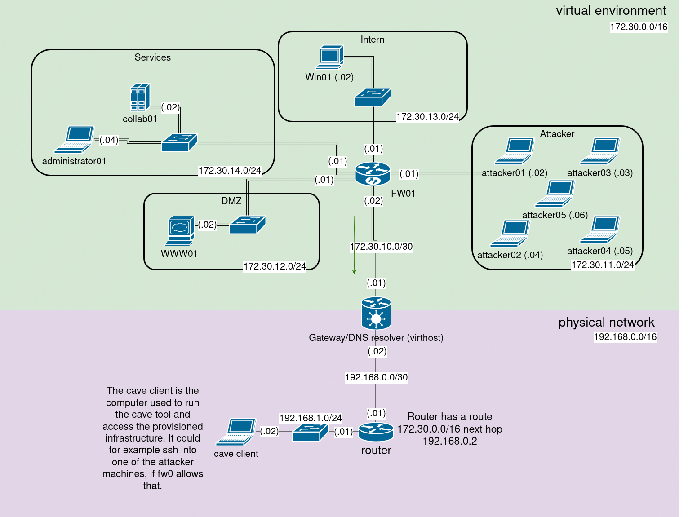

# Cave

**cave** is a Python-based automation toolkit for automated provisioning virtual infrastructure.  
Define your virtual infrastructure using code, cave handles the rest.  

Cave is still a prototype, use with caution.  

## Features

* Supports both linux and windows
* Automated provisioning of virtual machines
* Automated provisioning of networks
* Automated configuration of network interfaces
* Automated installation of ssh
* Python API
---


## Use Cases
* use in conjunction with ansible to build a full-fledged cyber range
* quick and easy setup for testing environments

---
## Example topology


---

## Getting Started

You will need a Linux machine as your libvirt virtualisation host.
You can use whatever distro you like, cave was tested and will be tested using debian.

### Install libvirt
* Install libvirt (debian) `apt install --no-install-recommends qemu-system libvirt-clients libvirt-daemon-system`
* Install qemu-img `apt install qemu-utils`
* Install dnsmasq `apt install dnsmasq`
* install software tpm and ovmf for windows 11/uefi `apt install swtpm stpm-tools ovmf`

In case you face selinux issues, a quick-fix might be disabling apparmor/selinux by setting "security_driver" to ["none"] in /etc/libvirt/qemu.conf. Then `systemctl restart libvirtd`  

* Setup routes to your cave host
In order to allow traffic for comunicating with the virtual infrastructure, you will need to setup routes.
Take an ipv4 range that you will later use to make the machines within your deployment accessible to your network.
The virtualisation host will act as a router/next hop for the virtual networks and machines.  
For an example, see [example topology](assets/example_topology.drawio.png)

* Download images
Download ISOs of the windows versions you will need, tested are: Windows 10, Windows 11, Windows-Server 16 and newer  
If you need to use Windows11/Any windows with uefi, you need to make a small change to the iso to make it boot without user interaction <https://serverfault.com/questions/353826/windows-boot-iso-file-without-press-any-key>.  
Download cloud-init images of the linux distributions you will use. Ubuntu <https://cloud-images.ubuntu.com/noble/current/noble-server-cloudimg-amd64.img> is tested.

---

## Usage
See [example](test/test.py) for an example.  
### Networks and Interfaces
```python
mngt = range.add_network(name="mngmt", 
                         host_isolated=False, 
                         ipv4="10.10.0.1", 
                         ipv4_subnet="255.255.255.0", 
                         isolate_guests=False,
                         ipv6="",
                         ipv6_prefix="",
                         mode="open")  

n1 = range.add_network(name="network1", 
                       host_isolated=True, 
                       ipv4="", 
                       ipv4_subnet="", 
                       isolate_guests=False, 
                       ipv6="", 
                       ipv6_prefix="", 
                       mode="")

i1 = Interface(mac="", 
               network=n1, 
               ipv4="10.10.1.2", 
               prefix_length=24, 
               is_mngmt=False) 

im = Interface(mac="", 
               network=mngt, 
               ipv4="10.10.0.2", 
               prefix_length=24, 
               is_mngmt=True) 
```

### Virtual Machines
```python
ubuntu_img = f"{REMOTE_IMAGES_DIR}/{os.path.basename(UBUNTU_IMAGE)}"
ld = range.add_linux_domain(name="linux01", 
                            hostname="lin01", 
                            base_image_path=ubuntu_img, 
                            interfaces=[i1, im],
                            graphics_passwd="pw",
                            disk_volume_size_gb=8,
                            memory=1024,
                            vcpus=2,
                            graphics_port="6000",
                            graphics_auto_port="no", 
                            graphics_address="0.0.0.0",
                            default_gateway="10.10.1.1",
                            dns_server="1.1.1.1",
                            management_default_gateway="10.10.0.1") 
```
